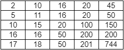
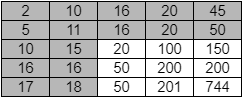
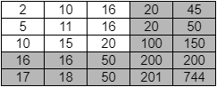
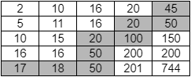
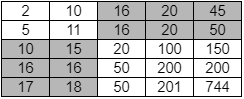

[](https://classroom.github.com/open-in-codespaces?assignment_repo_id=14748914)
# Assignment 10: 2D Sorted Array Search

You have learned that binary search is an efficient (O(log n)) way to search a sorted array, but what about a sorted 2D array? What is a sorted 2D array? It is a rectangular array that has the following two properties:

- Each row of the array has non-decreasing values. This means that for each row `i`, 

`a[i][0] <= a[i][1] <= ... <= a[i][n-2] <= a[i][n-1]`, where `n` is the length of each row.

- Each column of the array has non-decreasing values. This means that for each column `j`, 

`a[0][j] <= a[1][j] <= ... <= a[m-2][j] <= a[m-1][j]`, where `m` is the length of each column.

For this assignment, you will develop several different search algorithms for 2D sorted arrays. Here is an example of a 2D sorted array of integers:



## Files

- `REFLECTION.txt` (edit and submit): The reflection questions for this assignment. Note that one of the questions was also asked on the previous assignment. The answer you give should be updated and revised based on your experience working on this assignment.
- `src/main/java/search/Sorted2DArraySearch.java` (edit and submit): All required search methods need to be implemented in this file.
- `src/test/java/search/Sorted2DArraySearchTest.java` (do not change): I have written all the tests for you this time. If your code passes all of these tests, then you can be reasonably sure it is correct. However, to be fully correct, you must follow the appropriate implementation of each search method (copying the code from one to the others could pass all tests, but would be incorrect).
- `Sorted.png` (do not change): Image of 2D sorted array
- `Sorted-TopLeft.png` (do not change): Image of 2D sorted array with three quadrants in top-left highlighted
- `Sorted-BottomRight.png` (do not change): Image of 2D sorted array with three quadrants in bottom-right highlighted
- `Sorted-ZigZag.png` (do not change): Image of 2D sorted array with zig-zag search path highlighted
- `Sorted-Diagonal.png` (do not change): Image of 2D sorted array with two sub-rectangles highlighted
- `build.gradle` (do not change): This is a project configuration file that makes it easy to run unit tests.
- `.gitignore` (do not change): Tells GitHub to ignore certain files generated from compiling your code.
- `README.md` (do not change): The file you are currently reading.

## Testing

To execute my tests and the tests you eventually write, run the following console command:

```
gradle clean test
```

All search methods produce the same results, so I will also look carefully at your implementation to assess the correctness of your code.

If you want to debug the code without running test cases, for example by adding print statements to see what values variables have during execution, then you can execute the `main` method of `Sorted2DArraySearch.java`. First compile the code with this command (this will skip unit testing):
```
gradle build -x test
```
and then execute the compiled jar file with this command
```
java -jar build/libs/CS2A10-SortedArraySearch.jar
```

The three search methods that you must implement are the following:

## Three Quadrant Search

Implement this approach in the `threeQuadrantSubSearch` method. This method should be the kick-off for a recursive method that includes additional parameters defining the starting row and column and ending row and column of a rectangular subregion of the array. The minimum value in any rectangular subregion is always in the upper left, and the maximum value of any rectangular subregion is always in the lower right. So, if the value you are looking for is less than the minimum or greater than the maximum within a subregion, then you know the value is not in that region.

If the value you seek is between the minimum and the maximum, then you need to do further checks to see if it is actually present. Start by checking the middle value of the subarray ... if this is the value you are looking for, then you are done. Otherwise, your next action depends on whether the value you seek is less than or greater than the center value, but you will only be able to exclude one quadrant based on the outcome. In the example array from above, the center value is 20, so if the value you were seeking were less than 20, then the grey regions of this array would need to be searched.



The method you are defining is meant to search rectangular regions, so you should divide the grey cells above into three quadrants (roughly square shaped) and recursively search each. If the value you seek is greater than 20, then you would need to search the following grey cells:



Once again, in this case you should recursively search three quadrants. Recursively repeating this process will eventually create empty subrectangles, at which point you know the value you are searching for is not present.

## Zig-zag Search

This search method is not recursive, and can be completely implemented inside the method `zigzagSearch`. The idea behind this algorithm is to start at the lower left corner of the array, and compare it against the value you are searching for. If they are equal, then you return true, but otherwise the search continues. If the value you seek is less than the value you just checked, then you should move up one cell in the array. If it is greater, then you should move one cell to the right.

If you repeat this process in a loop, it should result in a zig-zag path through the array. You will either find the value you are looking for, or you will eventually go off an edge of the array, which would mean the value you are seeking is not present. For example, if you were seeking the value 45 in the array above, then the gray cells below illustrate the path you would follow:



All that is needed to complete this method is a single loop.

## Binary Search on Diagonal Plus Two Sub-rectangles 

This final algorithm should be implemented in the `binarySearchDiagonalSearch` method, but you will also make use of a helper method called `binarySearchDiagonal`.
	
The overall idea of this search is that you start by performing binary search along the diagonal of the array using the helper method `binarySearchDiagonal`, but instead of simply indicating the presence or absence of the value sought, this helper method indicates the location of the value if it is/were present. The result is returned in an instance of Java's `Point` class, which contains x and y integers. The `Point` class documentation is [here](https://docs.oracle.com/javase/7/docs/api/java/awt/Point.html). In the result you return, these values will represent a row and column within the array. If the value sought was found, then the `Point` is the location of the value. Otherwise, the `Point` is the location of the value along the diagonal that is less than the desired value, but whose following value is greater than the desired value. In other words, you return the `Point` that would bound the desired value from below along the diagonal.

For example, if you were searching for 16 in the example array, then a binary search along the diagonal would return (1,1), the location of the 11, because the next value along the diagonal is 20, and 11 < 16 < 20. Given this result, you would then need to recursively search the two rectangles identified in grey below:



In this example, 16 happens to be located in both subrectangles, though it could have simply been in one, or neither.

## Comments

For this project, all methods must be well commented, and any weird special cases should be explained. A common challenge throughout these algorithms is the fact that once you start dividing the array into regions, the concepts of "center" and "quadrant" and "diagonal" become a bit hard to define clearly. These terms become a bit imprecise, but you can still write correct code despite this. Finally, you will need to answer some questions about this assignment in `REFLECTION.txt`.

## Grading

- 10%: `REFLECTION.txt`: thoughtful answers to each question.
- 25%: `Sorted2DArraySearch.java`: Correct implementation of three quadrant search.
- 25%: `Sorted2DArraySearch.java`: Correct implementation of zig-zag search. 
- 25%: `Sorted2DArraySearch.java`: Correct implementation of diagonal binary search.
- 15%: `Sorted2DArraySearch.java`: Quality of comments and style across all code.

## Submission

You will submit your code via GitHub. You will learn a lot about using GitHub in future classes, but for this one you simply need to know some basic commands to get by. Whenever you want to save your work and save your most up-to-date changes to your GitHub repo, execute the following sequence of three commands by typing them in the terminal and pressing enter after each one.

```
git add *
git commit -m "Updated code"
git push
```

If these three commands do not all succeed, then I will not be able to see the changes you have made to the code. They may exist in your codespace, but they will not be visible in the GitHub repo. Make sure that the code you view in the GitHub repo via a browser matches what you want to submit. If any of these commands give errors indicating that the code cannot be added, committed, or pushed, then contact me immediately on Slack for help. Try to complete the assignment sufficiently ahead of the deadline to avoid anxiety from unexpected issues with the submission process.

