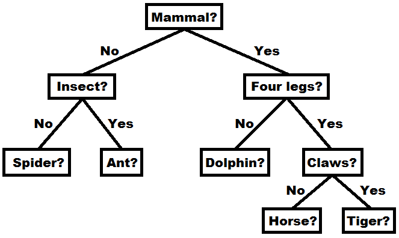

[](https://classroom.github.com/open-in-codespaces?assignment_repo_id=14813098)
# Assignment 11: Animal Guessing Decision Tree

Binary trees have many uses, and one useful type of tree is a decision tree. A decision tree is used to make a classification based on the properties of some entity. A binary decision tree contains a yes-or-no question in each non-leaf node. At each such node, the answer to the question determines which branch of the tree you would follow to ultimately classify the entity under consideration. The leaf nodes of the tree contain final classifications/answers. Here is a concrete example:



This decision tree can be used for an animal guessing game. The user first thinks of an animal, such as a horse, and then answers the questions in the tree: Is a horse a mammal? Yes, so go down the right branch. Does a horse have four legs? Yes, so go down the right branch. Does a horse have claws? No, so go down the left branch. Is the animal a horse? Indeed it is! The program has correctly identified the animal, and would be able to do so for tigers, dolphins, ants, and spiders as well. 

Of course, there are more animals than the small set defined in this tree, so you will write a program that learns from the user whenever a final answer is reached that is incorrect. For example, if the animal I had in mind were a honey bee, then I would say no to the animal being a mammal, yes to it being an insect, then no to it being an ant. At this point, the program should ask me to provide a yes-or-no question that would allow it to distinguish an ant from a honey bee. I could type, "Does it buzz?", because honey bees make a buzzing noise and ants do not. The program would incorporate this information into the tree, so that it would get this answer right the next time it comes up. Of course, building a large knowledge base is only useful if you save it to file between program runs and load it from file at the start of each program run. This is another expectation of you for this assignment.

## Files

You will need a very large number of files for this assignment, but most of them do not need to be changed by you. The code is based off of a project from the book. The files you need are below:

- `REFLECTION.txt` (edit and submit): The reflection questions for this assignment. Note that two of the questions were also asked on previous assignments. The answers you give should be updated and revised based on your experience working on this assignment.
- `src/main/java/tree/TreeInterface.java` (do not change): A general interface for trees from the book.
- `src/main/java/tree/BinaryTreeInterface.java` (do not change): The book's interface for binary trees, which extends the tree interface. Unlike the book version, this interface drops the requirement of supporting iterators.
- `src/main/java/tree/BinaryNode.java` (do not change): Class that can only be accessed within the `tree`. It represents a single node within a binary tree.
- `src/main/java/tree/BinaryTree.java` (do not change): Basic binary tree class from the book, with slight modifications.
- `src/main/java/tree/DecisionTreeInterface.java` (no change, no submit): The decision tree interface from the book, which extends the interface for binary trees. The comments from this file should guide you in writing code within the `DecisionTree` class.
- `src/main/java/tree/DecisionTree.java` (edit and submit): The decision tree class which you must write and comment.
- `src/main/java/game/GuessingGame.java` (edit and submit): This class manages the guessing game, and is taken from the book (with slight modifications). The only method you need to write (and comment) is the `learn` method.
- `src/test/java/game/GuessingGameTest.java` (edit and submit): This class tests the `play` method of the guessing game, which indirectly tests the `learn` method which you will write. The testing procedure is rather complex. One example is provided, and you must provide one more that is more substantial.
- `src/main/java/game/Client.java` (do not change): This is the program that you should actually execute. It interacts with the user and launches the guessing game. You do not need to modify this file, **but you MUST access its methods from your `GuessingGame` class for interacting with the console in order for the tests in `GuessingGameTest` to work**.
- `DecisionTree.png` (do not change): Image of an example decision tree for the game.
- `build.gradle` (do not change): This is a project configuration file that makes it easy to run unit tests and compile the project.
- `.gitignore` (do not change): Tells GitHub to ignore certain files generated from compiling your code.
- `README.md` (do not change): The file you are currently reading.

## Testing and Running

You will want to run unit tests and the guessing game program to evaluate your code. As usual, you can run tests with this command:
```
gradle clean test
```
However, to test the guessing game, you will need to interact with it yourself. First you need to compile the code. One way to do this is with this command:
```
gradle build
```
However, this command will only work if all of your unit tests pass. If you want to skip the unit tests when compiling then you can use this command:
```
gradle build -x test
```
This command compiles the code into a runnable `.jar` file: `build/libs/CS2A11-AnimalGuessingGame.jar`. You can run it with this command from the main project directory in the terminal:
```
java -jar build/libs/CS2A11-AnimalGuessingGame.jar
```
However, you may find it simpler to select `Run -> Run Without Debugging` from the menu while `Client.java` is selected. However, this will require you to install several Java-related extensions that the VS Code environment recommends to you from within the codespace.

## Guessing and Learning

Start this project by implementing and commenting the methods in the `DecisionTree` class that are derived from the `DecisionTreeInterface`. This excludes the methods for loading and saving the tree, which should be saved for last. You should implement the `learn` method in the `GuessingGame` class once the basic `DecisionTree` methods work. Only once the `learn` method works should you focus on saving and loading trees. The last step is to write additional unit tests in `GuessingGameTest`.
	
Once the basic decision tree methods from the `DecisionTreeInterface` work, you can execute `Client.java` using one of the methods described above to play a short game using the default tree with no learning. Next, you should implement the `learn` method of the `GuessingGame`. Note that the precise formatting of the text prompts required in the `learn` method can be deciphered by looking at the existing unit test in `GuessingGameTest`. Also, **make sure that all console interaction inside of the `learn` method is handled exclusively via methods in `Client`** that can be accessed via the instance variable inside of the `GuessingGame` class. Once the `learn` method works, each game you play in succession within a single session will be a bit different, because the tree will grow. Of course, you will need to build up the tree from scratch each time you play. This is the point where you should move on to saving and loading files.
	
The decision tree should be saved by doing a pre-order traversal and writing the value of each visited node on its own line within the file. However, instead of a normal pre-order traversal, which ignores the `null` children of leaf nodes, you will need to write these values to the file as `NULL`. This unique identifier is required in order to sense where a given branch in the tree ends. This will be important when loading the file and putting its data back into a tree. You will need to read the file one line at a time, but figure out how to store it in a tree. Basically, you will have a recursive method that makes recursive calls for the left and right branches of the tree, but treats a line of `NULL` from the file as a base case. There is some additional information in the code comments, but you will need to figure out the details on your own. However, here is an example of a validly formatted file representing a decision tree from the game:

```
Is the animal a mammal?
Is the animal a bird?
Is the animal an insect?
Squid
NULL
NULL
Ant
NULL
NULL
Parrot
NULL
NULL
Does the animal live in water?
Cow
NULL
NULL
Does the animal have four legs?
Dolphin
NULL
NULL
Hippopotamus
NULL
NULL
```

While writing code to save trees, you may create some invalidly formatted save files. This could cause formerly working code to crash, since it will attempt to load the badly formatted file rather than create a new tree from scratch. To fix this, simply delete any unwanted `animals.txt` file before trying to run the code again.

Once you can save and load your trees, you will be able to finish one session and then resume later with all of the previously entered data still available. You should be able to informally verify that the game works by playing it several times. Once you reach this point, you can execute `GuessingGameTest` to see if my provided test passes. It is possible that even if your game works, you may fail the test because of small discrepancies in the formatting of your text output (or because you incorrectly used `System.out` or defined your own input `Scanner`). Once your code passes my test, you can move on to write your own test case. Your test case should be written in a manner similar to mine, and will actually load the database file saved at the end of my test. Therefore, at the start of your test, you will need to verify that every animal inserted in the first test is contained in the loaded tree. Then, your test should add more animals to the tree and verify their correct insertion as well.

## Grading

You will be graded not only on functionality, but style, comments, and efficiency. The full grading details are as follows (no `REFLECTION.txt` this time):

- 10%: `REFLECTION.txt`: Thoughtful answers to each question. 
- 25%: `DecisionTree.java`: Basic methods (from `DecisionTreeInterface`). 
- 20%: `DecisionTree.java`: Ability to save and load decision trees.
- 10%: `DecisionTree.java`: Comments, style, and efficiency of implemented methods
- 10%: `GuessingGame.java`: Correct implementation of the `learn` method.
- 5%: `GuessingGame.java`: Thorough comments on the `learn` method.
- 20%: `GuessingGameTest.java`: Correctness/thoroughness of additional unit tests. 

## Submission

You will submit your code via GitHub. You will learn a lot about using GitHub in future classes, but for this one you simply need to know some basic commands to get by. Whenever you want to save your work and save your most up-to-date changes to your GitHub repo, execute the following sequence of three commands by typing them in the terminal and pressing enter after each one.

```
git add *
git commit -m "Updated code"
git push
```

If these three commands do not all succeed, then I will not be able to see the changes you have made to the code. They may exist in your codespace, but they will not be visible in the GitHub repo. Make sure that the code you view in the GitHub repo via a browser matches what you want to submit. If any of these commands give errors indicating that the code cannot be added, committed, or pushed, then contact me immediately on Slack for help. Try to complete the assignment sufficiently ahead of the deadline to avoid anxiety from unexpected issues with the submission process.
