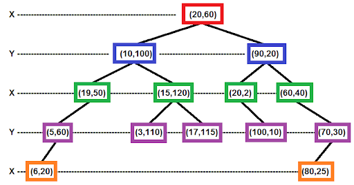
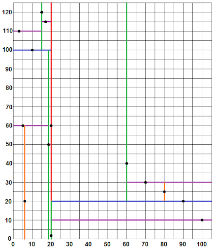
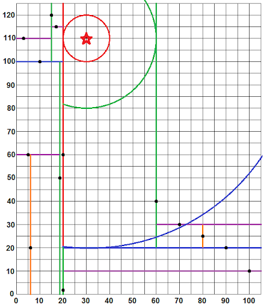

[](https://classroom.github.com/open-in-codespaces?assignment_repo_id=14906876)
# Assignment 12: Two-Dimensional kd-Tree

Let's say you had a map of the country that tracked the locations of all major cities in terms of latitude and longitude. On a 2D map, this is essentially the same as x/y coordinates. Now, what if you then look up your location on the map, and want to know what city is closest to you? If you just store the locations of the cities in a list, then you would have to calculate the distance between your location and every city in order to find the closest city. Fortunately, there is a more efficient way.
	
A kd-tree is a way of storing k-dimensional points in a tree that can be quickly searched. This assignment deals with points in 2D space, so you will be making a 2D-tree, or a 2-Dimensional kd-tree. This assignment is similar to a project from our book, but involves more details and has some extra requirements. Still, referencing the book is a good idea. The files you will need to get started are listed below:

## Files

- `REFLECTION.txt` (edit and submit): The reflection questions for this assignment. Note that one of the questions was also asked on the previous assignment. The answer you give should be updated and revised based on your experience working on this assignment.
- `src/main/java/tree/BinaryNode.java` (do not change): Same class from book and previous project.
- `src/main/java/tree/BinaryTree.java` (do not change): Same class from book and previous project.
- `src/main/java/tree/BinaryTreeInterface.java` (do not change): Same interface from book and previous project.
- `src/main/java/tree/TreeInterface.java` (do not change): Same interface from book and previous project.
- `src/main/java/tree/Located2D.java` (do not change): An interface for objects that have x/y coordinates, and thus have a location in two-dimensional space.
- `src/main/java/tree/LabelledPoint.java` (do not change): An example of a `Located2D` object that also has a label associated with each point. As a result, it is possible for two instances of this object to be at the same location, but have different labels.
- `src/main/java/tree/TwoDimensionTree.java` (edit and submit): New class that will contain your 2D-tree implementation. This class shares some similarities with the `BinarySearchTree` class described in the book, but differs enough that it would not make sense to simply extend that class.
- `src/test/java/tree/TwoDimensionTreeTest.java` (edit and submit): You will write JUnit tests for your 2D-tree in this class.
- `kdtree.png` (do not change): Image of a 2D-Tree.
- `grid.png` (do not change): Image of points corresponding to a 2D-Tree.
- `grid-circles.png` (do not change): Image of points corresponding to a 2D-Tree, with circles around a point whose nearest neighbor is sought.
- `build.gradle` (do not change): This is a project configuration file that makes it easy to run unit tests.
- `.gitignore` (do not change): Tells GitHub to ignore certain files generated from compiling your code.
- `README.md` (do not change): The file you are currently reading.

## Testing

To execute my tests and the tests you eventually write, run the following console command:

```
gradle clean test
```
To debug the code without running test cases you can execute the `main` method of `TwoDimensionTree.java`. First compile the code with this command (this will skip unit testing):
```
gradle build -x test
```
and then execute the compiled jar file with this command
```
java -jar build/libs/CS2A12-2DkdTree.jar
```

## 2D-Tree Implementation

A 2D-tree is more general than a binary search tree, because the points that it stores get "sorted" differently depending on what depth they are at in the tree. The tree you implement will store objects that implement the `Located2D` interface, which simply means that the objects have x/y coordinates. The 2D-tree can only contain one object with any given set of x/y coordinates, so searching depends exclusively on x/y coordinates. The class actually provides an inner class called `Point` (similar to Java's built-in `Point` class, but different in that it implements `Located2D`), which allows you to look up the object at or near a given location without knowing what other data it contains.

Whenever the tree is being searched for any reason, the branch that is followed in the tree will depend on the current depth in the tree. At the root (depth 0) the x coordinate of the search point is compared to the x coordinate of the point in the tree, with lower values sought for down the left branch and higher (or equal) values sought for down the right branch. At the next level (depth 1) the values of the y-coordinates are compared instead. The tree alternates back and forth between using x and y coordinates, so that x coordinates are compared at even depths and y coordinates are compared at odd depths. One example of this is provided in the book (and unit tests). Another is provided below.



In this tree, all points in the left sub-tree beneath the root have an x coordinate less than 20. All points in the right sub-tree have an x coordinate greater than or equal to 20. Notice that the point (20,2) is stored in the right sub-tree. However, the y coordinates beneath the root have no relation to the point in the root node. In this example, the left child point (10,100) happens to have a y coordinate greater than that of the root, and the right child point (90,20) happens to have a smaller y coordinate, but this need not be the case. The y coordinates are only checked on levels of the tree denoted with a Y on the left margin, thus the point (19,50) is a left child of (10,100) because 50 is less than 100. A geometric interpretation of this tree is shown below. 



Because the root point (20,60) divides the space according to its x-coordinate, there is a vertical line where x equals 20. The line is color coded red to match the color of the box (above) containing the root node. One level down, the points (10,100) and (90,20) split the space along the y axis, so on the left side of the red line there is a horizontal blue line where y equals 100, and to the right of the red line there is another blue line where y equals 20. This process continues for all other points in the tree, which is color coded so both figures match. The only anomaly worth pointing out is that the red line for x = 20 is actually green near the bottom because of the point (20,2) that appears in the right sub-tree. These vertical and horizontal lines split the 2D plane in a way that allows you to search for a point of interest while ignoring large irrelevant portions of the search space. This makes checking for the presence of a specific point and adding new points straight forward ... these operations are very similar to what is performed in a standard binary search tree. However, if I have a specific point in mind, and want to find out which point in the tree is closest to my query point, then a few extra steps need to be taken to make sure I return the right answer.

## Finding the Nearest Neighbor

Each time you descend one level into the 2D-tree, you are ignoring all points on the opposite side of a vertical or horizontal line. However, it is possible for a point on the other side of a line to be closer to a query point than any point on the same side, so extra care is needed when searching for the nearest neighbor to a given query point. Consider the example in the figure below, in which the red star represents the query point. The query point is at (30,110). The curved lines will be described momentarily.



The upcoming pseudo code describes the general process required to find the point nearest to the red star. Here are the specific steps that occur in this specific example. Essentially, we follow the normal search procedure, but maintain a guess of the closest point based on the points in the tree we have checked so far. If a horizontal or vertical barrier is ever closer than our current best guess, then we need to check the other side of that barrier. Given this plan, here are the steps of the search:

1. Compare x coordinates of (30.0,110.0) and (20.0,60.0), search right, closest distance = 50.99019513592785
2. Compare y coordinates of (30.0,110.0) and (90.0,20.0), search right, closest distance = 50.99019513592785
3. Compare x coordinates of (30.0,110.0) and (60.0,40.0), search left, closest distance = 50.99019513592785
4. No child to the left, so go back up to (60.0,40.0)
5. |30.0 - 60.0| = 30.0 < 50.99019513592785, so the right child of (60.0,40.0) is also searched
6. Compare y coordinates of (30.0,110.0) and (70.0,30.0), search right, closest distance = 50.99019513592785
7. No child to the right, so go back up to (70.0,30.0)
8. |110.0 - 30.0| = 80.0 >= 50.99019513592785, so the left child of (70.0,30.0) is not searched
9. Return back up to (60.0,40.0)
10. Return back up to (90.0,20.0)
11. |110.0 - 20.0| = 90.0 >= 50.99019513592785, so the left child of (90.0,20.0) is not searched
12. Return back up to (20.0,60.0)
13. |30.0 - 20.0| = 10.0 < 50.99019513592785, so the left child of (20.0,60.0) is also searched
14. Compare y coordinates of (30.0,110.0) and (10.0,100.0), search right, closest distance = 22.360679774997898
15. Compare x coordinates of (30.0,110.0) and (15.0,120.0), search right, closest distance = 18.027756377319946
16. Compare y coordinates of (30.0,110.0) and (17.0,115.0), search left, closest distance = 13.92838827718412
17. No child to the left, so go back up to (17.0,115.0)
18. |110.0 - 115.0| = 5.0 < 13.92838827718412, so the right child of (17.0,115.0) is also searched
19. No child to the right, so go back up to (17.0,115.0)
20. Return back up to (15.0,120.0)
21. |30.0 - 15.0| = 15.0 >= 13.92838827718412, so the left child of (15.0,120.0) is not searched
22. Return back up to (10.0,100.0)
23. |110.0 - 100.0| = 10.0 < 13.92838827718412, so the left child of (10.0,100.0) is also searched
24. Compare x coordinates of (30.0,110.0) and (19.0,50.0), search right, closest distance = 13.92838827718412
25. No child to the right, so go back up to (19.0,50.0)
26. |30.0 - 19.0| = 11.0 < 13.92838827718412, so the left child of (19.0,50.0) is also searched
27. Compare y coordinates of (30.0,110.0) and (5.0,60.0), search right, closest distance = 13.92838827718412
28. No child to the right, so go back up to (5.0,60.0)
29. |110.0 - 60.0| = 50.0 >= 13.92838827718412, so the left child of (5.0,60.0) is not searched
30. Return back up to (19.0,50.0)
31. Return back up to (10.0,100.0)
32. Return back up to (20.0,60.0)

The point that has a distance of 13.92838827718412 from the query point is (17,115). Annoyingly, we had to search all the way down the right sub-tree, only to eventually find the closest point in the left sub-tree. Such bad luck makes the search cost more, but it is still better than checking every point, and for larger trees that are kept properly balanced, there will often be great savings.

The curves in the figure above are from concentric circles around the query point. Notice that because the space is divided by vertical and horizontal lines, these circles end up being tangent to the border lines. This makes calculating the distance from the query point to one of these barriers as easy as determining the difference between the appropriate coordinates (absolute difference between either x or y coordinates, depending). This distance is frequently compared to the distance to the closest point encountered so far, which must be updated as the search progresses, regardless of how the search proceeds up and down the tree. Similarly, the actual closest point encountered so far needs to be tracked in a similar manner. Both variables can be stored in a structure similar to the `ReturnObject` class used in implementing the `remove` method of a binary search tree, as discussed in Chapter 26 of the book.

Without further ado, here is pseudo code for the nearest neighbor algorithm:

```
// query is the point to look for.
// node is a tree node.
// guessRef references an object with the closest point so far.
// bestDistRef references an object with the closest distance so far.
// Return type is void, but guessRef will reference the object in
// tree closest to the query point at the end of execution.
void NearestNeighbor(query, node, guessRef, bestDistRef)
  if node is null: return

  dist = distance between query point and point in node
  if dist < bestDistRef.dist:
    bestDistRef.dist = dist
    guessRef.point = point in node

  // The coordinate is either x or y depending on the current depth.
  // vertical bars are for absolute value.
  diff = |query point's coordinate - node point's coordinate|
  if query point's coordinate < node point's coordinate:
    NearestNeighbor(query, node.left, guessRef, bestDistRef)
    if diff < bestDistRef.dist:  //Closest point could be on other side
      NearestNeighbor(query, node.right, guessRef, bestDistRef)
  else // query point's coordinate >= node point's coordinate
    NearestNeighbor(query, node.right, guessRef, bestDistRef)
    if diff < bestDistRef.dist:  //Closest point could be on other side
      NearestNeighbor(query, node.left, guessRef, bestDistRef)
```

The initial call to this recursive algorithm sets the node to the root of the tree, and the `bestDistRef` contains infinity. Note that additional/different parameters may be needed than what is shown in this pseudo code to create a working result in Java.

## Grading

- 10%: `REFLECTION.txt`: thoughtful answers to each question
- 40%: `TwoDimensionalTree.java`: Correct functioning code 
- 15%: `TwoDimensionalTree.java`: Good comments, style, and efficiency
- 35%: `TwoDimensionalTreeTest.java`: Correct/thorough tests

## Submission

You will submit your code via GitHub. You will learn a lot about using GitHub in future classes, but for this one you simply need to know some basic commands to get by. Whenever you want to save your work and save your most up-to-date changes to your GitHub repo, execute the following sequence of three commands by typing them in the terminal and pressing enter after each one.

```
git add *
git commit -m "Updated code"
git push
```

If these three commands do not all succeed, then I will not be able to see the changes you have made to the code. They may exist in your codespace, but they will not be visible in the GitHub repo. Make sure that the code you view in the GitHub repo via a browser matches what you want to submit. If any of these commands give errors indicating that the code cannot be added, committed, or pushed, then contact me immediately on Slack for help. Try to complete the assignment sufficiently ahead of the deadline to avoid anxiety from unexpected issues with the submission process.
