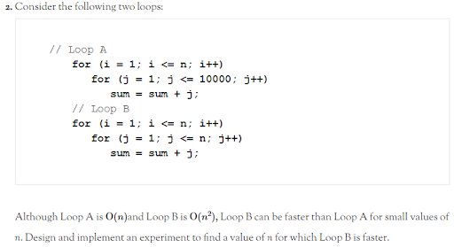
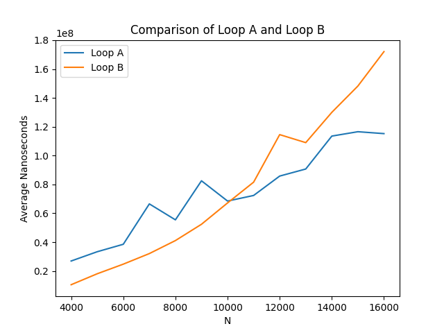

[](https://classroom.github.com/open-in-codespaces?assignment_repo_id=13683537)
# Assignment 3: Big Oh Timing Project

This project comprises 30 points for Assignment 3. The remaining 70 points of the assignment are part of the Assignment 3 quiz available at the link on Moodle. Here are files you will work with:

## Files

- `src/main/java/timing/Timing.java` (edit and submit): This file runs your timing experiment and produces results.
- `data.txt` (create and submit): This file does not exist in the repository, but it will by the time you complete the project. Running `Timing.java` should produce this file and fill it with the data needed to compare the two loops (see description below).
- `timing.png` (create and submit): This file also does not exist yet. Once `data.txt` is filled with the right data, this file will be used to make a plot you can use to analyze your results.
- `timing.py` (do not change): This is a script in the Python language that will be used to generate `timing.png` from `data.txt`. Instructions for using it appear later below.
- `build.gradle` (do not change): This is a project configuration file that makes it easy to compile the project.
- `.gitignore` (do not change): Tells GitHub to ignore certain files generated from compiling your code.
- `README.md` (do not change): The file you are currently reading.
- `A3Project.png` (do not change): Image of the project description from the textbook.

## Book Timing Project

The project below comes from our textbook. It is Project #2 in the Projects section at the end of Chapter 4. The bare text from the book is shown below, but additional requirements and explanation are provided afterward:



## Additional Requirements

You will turn in your Java source code via GitHub Classroom as with previous Assignments. The results of your experiment will also be turned in via GitHub classroom, but you will need to explain your experiment in the last question included in the Assignment 3 quiz on Moodle.

At the top of the page of the textbook where the problem above appears, there is an explanation of how to time the execution of your code in milliseconds. However, you will use `System.nanoTime()` instead, as already done in the provided starter code. You will write your code to time each of the loops multiple times for each value of N that you consider. Specifically, for each value of N you will run the code 10 times and take the average. However, the overall program should be written in such a way that a single execution of the program performs all needed repetitions of the loops for different values of N. Specifically, running your code will produce a text file called `data.txt` that contains all the data you need.

## Data and Analysis

If you run the provided starter code in `Timing.java` it will create a file called `data.txt` whose first line is the following:
```
#N	A1	A2	A3	A4	A5	A6	A7	A8	A9	A10	AVG-A	B1	B2	B3	B4	B5	B6	B7	B8	B9	B10	AVG-B
```

These represent the column headers of a table full of data that you need to produce (kind of like a spreadsheet). The line starts with a *#* so that we can ignore this line when processing the data (like a comment). The *N* is the value of `N` being input to the loops during testing. The *A1* through *A10* represent the execution times of Loop A on different runs of the experiment. *AVG-A* is the average of *A1* through *A10* for that given value of *N*. Then the *B1* through *B10* and *AVG-B* represent the same information for Loop B.

When you run the code I initially provide, there will also be some numbers on the next two lines. The first line starts with 100 and the next with 200. The reason these numbers appear is because they are the only numbers in the array `valuesOfN` inside of `Timing.java`. You will need to change the contents of `valuesOfN` to suit the needs of your experiment. After each of these numbers appear 10 more numbers followed by a 0.0. The 10 numbers are the execution times in nanoseconds for Loop A. You'll notice that there is variation on each repetition, but the numbers on a given line are mostly close to each other. The last number is 0.0, because the correct value of `averageA` is not yet computed in the code. Correctly computing this is your job. You also need to add code that will time the execution of Loop B as well, compute its average, and print the information to the file.

## Running Code and Displaying Data

There are several ways to run the code. The easiest is to select `Run -> Run Without Debugging` from the menu while `Timing.java` is selected. However, this will require you to install several Java-related extensions that the VS Code environment recommends to you from within the codespace.

Another option is to first build the project with this command:

```
gradle build
```

This creates a runnable `.jar` file you can launch with this command:

```
java -jar build/libs/CS2A3-Timing.jar
```

However you run the code, a successful execution will create the file `data.txt` in your project directory. If the file exists and is correctly formatted (23 columns of data), then you can run `timing.py` to create a chart displaying the data. However, you will first need to execute this command at least once in the codespace:

```
pip install matplotlib
```

This installs a code library that makes it easy to create the kind of chart we want to see. Create a chart from the data file with this command:

```
python timing.py
```

If this succeeds, a file `timing.png` will appear in your project directory. The VS Code environment in the codespace will allow you to view `.png` files so you can see the results. The chart should contain two lines plotting the average execution time of Loops A and B for different values of N. You need to decide on appropriate values for the first and last value of N, as well as the increment between rows (every 10, every 100, every 1000?). You should find values of N that result in these lines crossing roughly in the middle of the figure, but behaving consistently on either side. The shape of each curve should be evident. Note that there may be anomalous spikes in some of the lines, but a general trend should be clear.

The image is also displayed below, but if you have not successfully produced and committed an image yet, it will show as a dead link below:



## Grading

This project makes up 30% of the grade for Assignment 3. The components of the assignment contribute to the grade in this way 

- 10% for code (submit via GitHub)
- 10% for results (`data.txt` and `timing.png` submitted via GitHub)
- 10% for explanation (last question of “Assignment 3: Big-Oh and Efficiency” on Moodle)

## Submission

You will submit your code and results via GitHub. You will learn a lot about using GitHub in future classes, but for this one you simply need to know some basic commands to get by. Whenever you want to save your work and save your most up-to-date changes to your GitHub repo, execute the following sequence of three commands by typing them in the terminal and pressing enter after each one.

```
git add *
git commit -m "Updated code"
git push
```

If these three commands do not all succeed, then I will not be able to see the changes you have made to the code. They may exist in your codespace, but they will not be visible in the GitHub repo. Make sure that the code you view in the GitHub repo via a browser matches what you want to submit. If any of these commands give errors indicating that the code cannot be added, committed, or pushed, then contact me immediately on Slack for help. Try to complete the assignment sufficiently ahead of the deadline to avoid anxiety from unexpected issues with the submission process.
