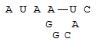
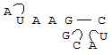

[](https://classroom.github.com/open-in-codespaces?assignment_repo_id=13974237)
# Assignment 5: Recursion and Bioinformatics

Our book discusses the power of recursion, but also reveals how inefficient it can be in certain circumstances. This assignment will require you to interpret and implement some recursive algorithms, and make them more efficient with a technique called memoization. 
```diff
- Note that recursive solutions are required for this assignment. 
```
To give you an appreciation for how important these techniques are in the real world, the specific algorithms you implement will be related to bioinformatics, which is the application of computer science techniques to solve interesting problems in biology. The files you will need to start are listed below:

## Files

- `REFLECTION.txt` (edit and submit): The reflection questions for this assignment. Note that two of the questions were also asked on the previous assignment. The answers you give should be updated and revised based on your experience working on this assignment.
- `src/main/java/bio/Bioinformatics.java` (edit and submit): This is the class that will contain your recursive bioinformatics algorithms. You will be implementing slow and fast (using memoization) versions of each algorithm.
- `src/test/java/bio/BioinformaticsTest.java` (edit and submit): This contains tests for your algorithms. Some tests are already present, but you must add more.
- `RNA1.png` (do not change): Image for describing RNA minimal energy folding.
- `RNA2.png` (do not change): Image for describing RNA minimal energy folding.
- `build.gradle` (do not change): This is a project configuration file that makes it easy to run unit tests.
- `.gitignore` (do not change): Tells GitHub to ignore certain files generated from compiling your code.
- `README.md` (do not change): The file you are currently reading.

## Memoization 

Memoization is a technique you will learn more about in later classes, but the basic technique is simple enough to be worth presenting here (it is not discussed in our textbook). Essentially, whenever we compute a result, we save it in a way that is easy to retrieve. Then, if we need that result again, we simply retrieve it from memory instead of recomputing it. You should recall from our book that one of the major problems with computing numbers in the Fibonacci sequence recursively is that the computer repeats the same work over and over, resulting in a very slow run time. The file `Bioinformatics.java` contains both a slow implementation of the Fibonacci algorithm, and a faster one that uses memoization. This particular implementation is not necessarily the best, but it demonstrates the idea of memoization in a way that should be easy to understand and extend to the real problems of this assignment. Study these algorithms well to understand the concept of memoization.
	
The real problems for this assignment that you must solve are both related to biological sequences, specifically DNA strings and RNA strings.

### Longest Common Subsequence Between Two DNA Strings

DNA stands for **d**eoxyribo**n**ucleic **a**cid, and it is the molecule possessed by all organisms that determines how the organism will grow and develop. DNA is the code that gets executed in order to create new organisms. Chemically, the DNA code is made up of four bases, known as adenine (A), guanine (G), cytosine (C), and thymine (T). Therefore, a simple way of representing an individual’s DNA sequence is with a String consisting only of the letters A, G, C, and T. This is the representation used in this assignment.

A common problem in molecular biology is that of sequence alignment. Given DNA sequences from two different organisms, biologists often want to match up similar portions of those sequences in order to focus on the portions that are different. Such alignment helps biologists determine which bases in the sequence would need to be changed in order to transform one into another, which then allows biologists to assess how closely related two different organisms are.

Genetic mutation can cause several changes in DNA sequences: any given base (A, G, C, or T) can be changed into any other base, but portions of DNA can also be added to a sequence or deleted from it (even in the middle). However, mutations are rare, and biologists are often aligning closely related sequences, so it makes sense to favor alignments that involve as few mutations as possible. A proper implementation of an alignment algorithm therefore involves considering different possible alignments, and scoring them based on both the number and type of mutations that would need to have occurred in order to transform one sequence to another. You will be doing something slightly simpler in this assignment.

Specifically, you must write an algorithm that determines the length of the longest common subsequence between two DNA strings (though such an algorithm will also work for any arbitrary pair of strings, and also has applications beyond bioinformatics). Below is an example of the longest common subsequence problem. Here are two DNA sequences:

```
    Seq1 = ACGGTGT
    Seq2 = CGTTCGGCTA
```

Note that the sequences are of different lengths. Each sequence possesses several subsequences. A subsequence is a sequence derived from another sequence by deleting some elements without changing the order. Therefore, ATT is a subsequence of Seq1 (A~~CGG~~T~~G~~T), and CT is a subsequence of Seq2 (C~~G~~T~~TCGGCTA~~). However, neither of these subsequences is common to both sequences. An example of a common subsequence is CGT, since it is a subsequence of both Seq1 (~~A~~CG~~G~~T~~GT~~) and Seq2 (CGT~~TCGGCTA~~), but it is not the longest subsequence. The longest subsequence is CGTGT. The sequences align in the following manner:

```
    Seq1 = ACGGT  G  T
            || |  |  |
    Seq2 =  CG TTCGGCTA
```

The length of this longest common subsequence is 5, and determining this number is all that is required of you in this part of the assignment (determining the actual subsequence is a bit harder). The recursive solution to this problem essentially checks all possibilities in a structured way (brute force), but you will also need to add memoization so that you are not repeatedly solving the same subproblems.

As is often the case with recursion, the trick to solving this problem is to solve a more general problem. Define `S(seq1,seq2,i,j)` as the length of the longest common subsequence between the first `i` characters of `seq1`, and the first `j` characters of `seq2`. So, if you try to calculate `S("ACGGTGT","CGTTCGGCTA",2,3)` then you are actually determining the length of the longest common subsequence between AC and CGT, which would be 1 because the longest common subsequence between these strings is C. Notice that if `i` or `j` equal -1, then the length of the subsequence is 0, because you are comparing one string to the empty string. This is the base case. The rest of `S(seq1,seq2,i,j)` can be defined recursively as the maximum across the following three possibilities:

- Ignore the last character of `seq1`. This length is represented by `S(seq1,seq2,i-1,j)`
- Ignore the last character of `seq2`. This length is represented by `S(seq1,seq2,i,j-1)`
- If the last characters of each string are the same, then they can be part of a common subsequence. In this case, the length of your subsequence increases by one, and you move on to the next character in each string. This quantity is represented by `S(seq1,seq2,i-1,j-1)+1`. This case is actually guaranteed to be larger than either of the other two options, so you don't need to consider the first two when this option is possible.

This recursive formula will be used by your `slowDNAScore` method. More accurately, one `slowDNAScore` method is a kick-off method for your actual recursive method, which is also called `slowDNAScore`. 
```diff
- Note: do NOT use the substring method.
``` 
Instead, use parameters defining index ranges within the strings, as done in the definition of `S(seq1,seq2,i,j)` above.

Your `fastDNAScore` will use essentially the same approach, but will also involve memoization. This means storing results you have already calculated so you do not need to calculate them again. The best way to do this is by passing around a 2D array with dimensions N by M, where N is the length of the first string and M is the length of the second string. 

### Minimal Energy Folding of an RNA String

RNA stands for **r**ibo**n**ucleic **a**cid. RNA and DNA are similar, but contrast in many important ways. Like DNA, RNA is also made up of chemical bases, but the specific bases are adenine (A), uracil (U), cytosine (C) and guanine (G). Notice that the U replaced the T that DNA has. More importantly, RNA is typically single-stranded while DNA is double-stranded. Every base in a DNA string is actually paired with a complementary base, so that the two complementary strings intertwine in an iconic double-helix shape. In DNA, bases A and T always pair up, and bases C and G always pair up. Therefore, the string, ACGGTGT, is actually two strings, because this first string is intertwined with its complementary string, TGCCACA. In contrast, the single-stranded nature of RNA typically causes it to fold up into unusual shapes.
	
In an RNA string, C still wants to pair with G, and A pairs up with U (remember that there is no T). The RNA string can actually fold in on itself so that a base on one part of the RNA string pairs with a complementary base on another part of the string. RNA will typically favor a shape that is in a minimal energy state. This simply means that a maximal number of base pairings occur (any unpaired bases in the string increase its overall energy). However, there are geometric constraints on which bases can pair off, as shown by the following example. Here is an RNA string:

``` 
AUAAGGCAUC
0123456789
```

I've numbered the indices of the string for convenience. The bases of this string can pair up in a variety of ways. For example, the A at index 3 could pair off with the U at index 8. The folded RNA string would look like the following.



The pairing of the bases has created a loop in the string. From this point forward, it is easy for unpaired bases outside of the loop to pair together, and for unpaired bases inside the loop to pair together, but we will assume that bases inside the loop cannot pair with bases outside of the loop. For example, the A inside of the loop cannot pair with the U on the left side of the loop. This is known as the "no pseudoknots" assumption (strictly speaking, this is not alway true, because the string can also fold in 3 dimensions. However, it is true in many cases, and is a good first approximation in others, so we will not allow pseudoknots). As a result, this pairing has effectively split the problem into two subproblems: find the minimal energy folding of AUAC (the unpaired bases outside the loop) and the minimal energy folding of GGCA (the unpaired bases inside the loop). The actual minimal energy folding of this string looks like the following:



There are several interesting things worth noting here. First, directly adjacent bases can pair off. Next, the loop that we considered above turns out not to be present in this minimal energy folding. Finally, the number of base pairings that occur is 4. You must write a recursive algorithm that determines the number of base pairings (you do not need to determine the actual resulting structure, as that is a harder problem).

As before, the trick to solving this problem with recursion is to solve a more general problem. For this problem, define the score `S(seq,i,j)` as the maximal number of RNA base pairings in a substring of seq starting at the `i`-th character and ending at the `j`-th character (both inclusive). So, `S("AUAAGGCAUC",3,6)` would be the maximal number of base pairings in AGGC, which is simply 1, since one G can pair with the C. We require that `i < j`, and define the score to be 0 if `i ≥ j`. When `i` is before `j`, then `S(seq,i,j)` is defined recursively as the maximum across the following cases:

- If the characters at positions `i` and `j` can be paired, then we can join them to make a RNA loop, and then look for pairings within that closed loop. This score is thus `1+S(seq,i+1,j-1)`. This case always beats the ones below, and should be favored whenever possible.
- We can ignore the first character to get the score `S(seq,i+1,j)`
- We can ignore the last character to get the score `S(seq,i,j-1)`
- We also have to consider every possible way of splitting the string into two substrings, and thus two subproblems whose scores are added up. This score would be the maximum value of `S(seq,i,k)+S(seq,k+1,j)` for every value of `k` between `i` and `j`. Although we are using recursion, this step requires a loop across values of `k`.

This recursive formula will be used by one of your `slowRNAScore` methods, while the other `slowRNAScore` will be the kick-off for your recursive method. 
```diff
- As before, you should NOT use the substring method.
``` 
Your `fastRNAScore` will use essentially the same approach, but will also involve memoization. In this case you will need a 2D array with dimensions N by N, where N is the length of the one RNA string under consideration. 

## Testing

Some tests for all of these methods already exist in `BioinformaticsTest.java`. Your code must pass all of these tests, as well as additional tests you create. As usual, you need a variety of interesting tests that cover various possibilities. Simply follow the instructions in `BioinformaticsTest.java` when it comes to writing the tests.

To execute the unit tests (both mine and the ones that you will write), simply type the following command in the terminal and press enter:
```
gradle clean test
```
You want all tests to pass before submitting, but you also need to make sure that your tests are thorough enough to properly test the code.

For the longest common subsequence problem, you need tests that are only practical for the fast (memoized) version of your method. These can be difficult to come up with. You can test long, seemingly random strings, but the challenge here is knowing what the correct answers are. To help you, you may use [Wolfram Alpha](https://www.wolframalpha.com/). Here is how it can help you with the longest common subsequence problem. Type (or copy-paste) the following into the search box:

```
LongestCommonSequence["TCCCAGTTATGTCAGGGGACACGAGAATGCAGAGAC","AATTGCCGCCGTCGTTTTCAGCAGTTATGTCAGATC"]
```

This is one of the test cases provided to you in `BioinformaticsTest.java`, and you should get the same answer (for String length) from Wolfram Alpha that is expected by my test: 23. You can create other test cases using Wolfram Alpha as well. However, note that the input box on the site has a character limit. To get around this, you'll need to create a free account on [Wolfram Cloud](https://www.wolframcloud.com/) and execute the command there instead. You can modify the parameters to your `LongestCommonSequence` command to test out even longer DNA strings.

Unfortunately, such online tools for RNA sequence folding are much more complicated and difficult to use, so the expected tests are a bit simpler. You will need to compute small examples by hand, and test to see that they actually work. You can share test cases or ask for help with test cases on Slack, so please take advantage of this.

If you want to debug the code without running test cases, for example by adding print statements to see what values variables have during execution, then you can call methods from the `main` method of `Bioinformatics.java`. To execute the code here, first compile it with (this will skip unit testing):
```
gradle build -x test
```
and then execute the compiled jar file with this command
```
java -jar build/libs/CS2A5-RecursiveBioinformatics.jar
```

## Grading

This assignment will be graded as follows:

- 10%: `REFLECTION.txt`: thoughtful answers to each question
- 20%: `Bioinformatics.java`: for functionality of slow DNA method
- 20%: `Bioinformatics.java`: for functionality of slow RNA method
- 10%: `Bioinformatics.java`: for functionality of fast DNA method
- 10%: `Bioinformatics.java`: for functionality of fast RNA method
- 16%: `Bioinformatics.java`: for comments in Bioinformatics.java
- 8%: `BioinformaticsTest.java`: for testing both DNA scoring methods
- 6%: `BioinformaticsTest.java`: for testing both RNA scoring methods

## Submission

You will submit your code via GitHub. You will learn a lot about using GitHub in future classes, but for this one you simply need to know some basic commands to get by. Whenever you want to save your work and save your most up-to-date changes to your GitHub repo, execute the following sequence of three commands by typing them in the terminal and pressing enter after each one.

```
git add *
git commit -m "Updated code"
git push
```

If these three commands do not all succeed, then I will not be able to see the changes you have made to the code. They may exist in your codespace, but they will not be visible in the GitHub repo. Make sure that the code you view in the GitHub repo via a browser matches what you want to submit. If any of these commands give errors indicating that the code cannot be added, committed, or pushed, then contact me immediately on Slack for help. Try to complete the assignment sufficiently ahead of the deadline to avoid anxiety from unexpected issues with the submission process.
